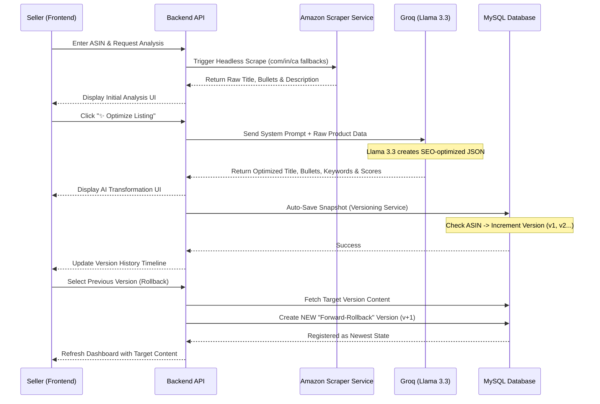

# System Architecture & Data Flow

This document outlines the end-to-end technical flow of the Amazon Product Listing Optimizer, covering data extraction, AI optimization, and version control history.

## High-Level Flow Diagram

## Technical Breakdown

### 1. Data Fetching (Resilient Scraping)
- **Multi-Domain Strategy**: To handle Amazon's anti-bot measures, the scraper tries multiple top-level domains (.com, .in, .co.uk) in a fallback loop.
- **Header Rotation**: Uses a randomized set of User-Agents and browser-like headers to mimic real human requests.
- **Parsing**: Employs `Cheerio` to extract data from specific Amazon selectors (`#productTitle`, `#feature-bullets`, etc.).

### 2. AI Integration (Agentic Optimization)
- **Engine**: Powered by **Groq** using the **Llama 3.3 70B** model.
- **Prompting**: Uses a strict system prompt that instructs the AI to output valid JSON. It focuses on:
    - **Amazon SEO**: Placing high-intent keywords naturally.
    - **Persona**: Acting as an expert Amazon Copywriter.
    - **Scoring**: Calculating a confidence score based on keyword density and engagement potential.

### 3. Storage & History (Forward-Rollback Strategy)
- **MySQL Architecture**: Two primary tables: `products` (metadata) and `listing_versions` (the actual snapshots).
- **Forward-Rollback**: Instead of deleting a version, a "Rollback" creates a *new* version entry with the content of the old one. This preserves the complete timeline of every change ever made.
- **JSON Serialization**: Complex fields like Bullets and Keywords are stored as JSON strings in the database and parsed in the Backend Model to ensure array integrity.
